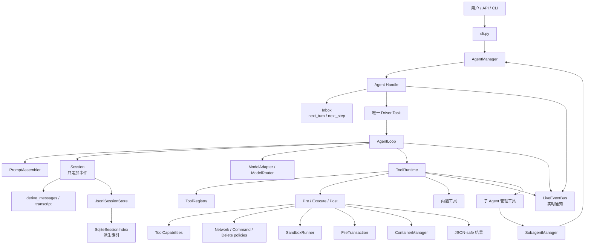
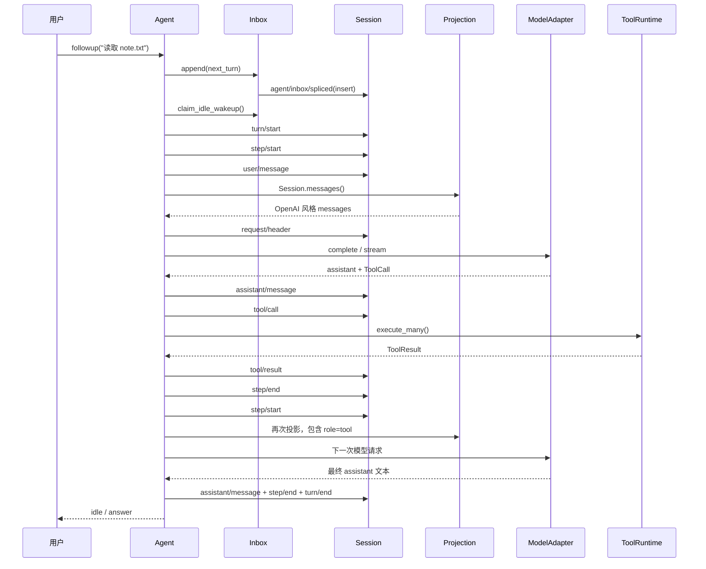
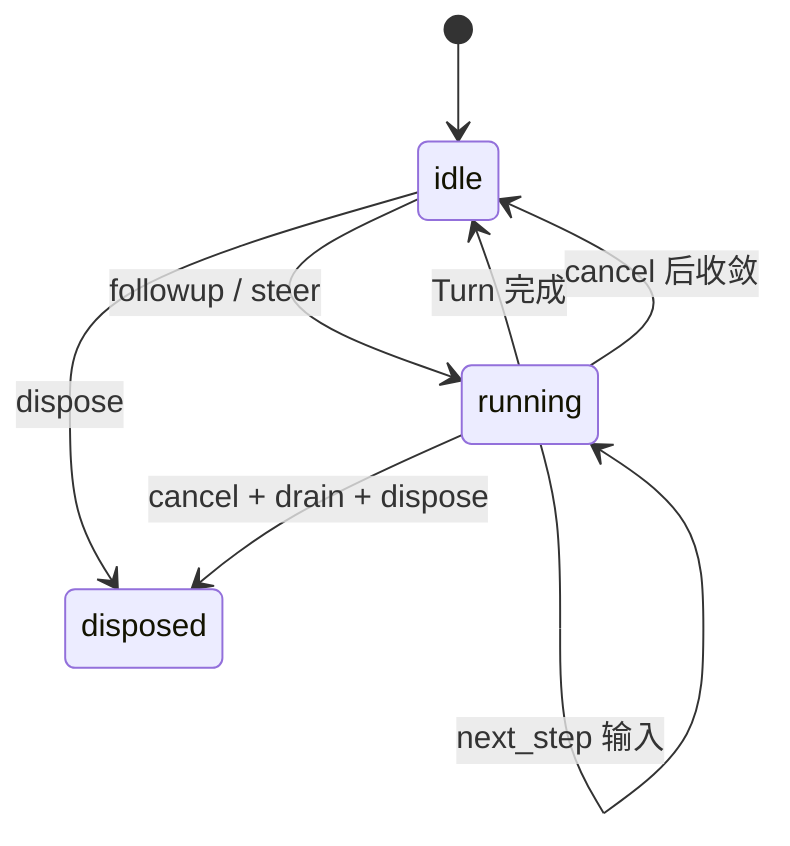
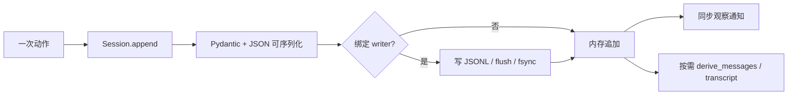
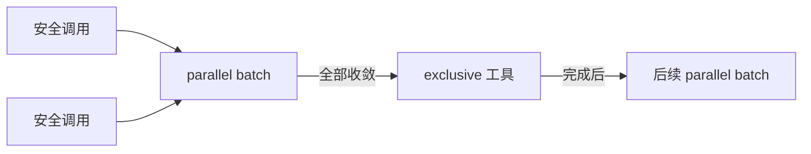

# python-agent 源码导读与快速复现教程

> 这是一份按当前工作树编写的中文源码教程。本文假定你已经在 `agent` conda 环境中，
> 不展开环境安装；重点放在每个 `src` 文件的职责、真实调用链、事件日志和如何复现。

## 0. 读完你应该掌握什么

`python-agent` 不是“把 prompt 发给模型”的薄封装，而是一个小型 Agent Harness。它把
一次任务拆成可以持久化、恢复和审计的事实：

```text
用户输入
  → Inbox 排队
  → Turn / Step 生命周期
  → ModelRequest
  → AssistantResponse
  → ToolRuntime 执行工具
  → tool/result 回到 Session
  → 下一次 ModelRequest
```

最重要的设计决定有六个：

1. **Session 事件日志是真相源。** `messages()`、transcript、SQLite 搜索索引和 TUI
   都是从事件派生的视图，不维护第二份模型历史。
2. **动态内容先记录，后进入模型。** 用户消息、完整 assistant 响应和工具结果必须先
   变成事件，下一步才通过 `Session.messages()` 投影到请求里。
3. **Agent Handle 与 AgentLoop 分离。** `AgentLoop` 解决一次 Turn 的推理闭环；
   `Agent` 负责长期存活、单 Driver、Inbox、取消和状态。
4. **工具安全策略集中在 Runtime。** 参数校验、workspace 边界、权限、审批、超时、
   输出裁剪都位于业务工具之外。
5. **所有异步资源都要有主人。** Driver、并发工具 Task、子 Agent watcher、Bash
   进程组都会由创建它们的对象取消并等待收敛。
6. **Driver 生命周期和任务结果状态分离。** `idle` 只表示当前没有运行中的 Driver，
   不代表最近任务已经完成；`task_status` 会区分 `completed`、`paused`、`cancelled` 和
   `error`。

本文已经逐行阅读当前 `src/python_agent` 下的 71 个 Python 文件；之后的“逐文件导读”
按真实目录逐个说明。为了快速建立整体感觉，建议先读第 1～3 节，再回头查文件。

> **当前实现状态（2026-09-03）**：P0 边界已经落地，包括通用流终止帧与 `length` 执行
> 闸门、EventBus 观察者隔离、bubblewrap Bash containment、`FileTransaction` 文件事务、
> ToolResult JSON-safe 归一化、ToolCapabilities fail-closed 默认、子 Agent 能力继承、
> fork lineage 重置和同步 child 结果去重。另已加入 SANBOX 权限等级、独立网络模式、
> DeletePolicyEngine、任务生成文件清单、Shell 风险分析和固定 Docker L3 后端。下面涉及
> 这些机制的章节均按当前源码说明；Shell 还会按受信任启动环境只读挂载当前 Conda/NVM
> runtime，并在交互式 `chat` 中等待用户处理高风险审批；
> `IMPROVEMENTS.md` 中的修复前复现仍作为历史背景保留。

---

## 1. 五分钟跑通最小闭环

在项目目录执行：

```bash
cd /home/m13jh/projects/python_project/agent/python-agent
conda activate agent
python -m python_agent run "你好，介绍一下自己"
```

默认 Provider 是 `fake`，所以不需要 API Key。一次性运行会把 Session 存到当前工作区的
`.python-agent/sessions/<session-id>/`，并在 stderr 打印 Session ID。

让 Fake Adapter 真的调用一个文件工具：

```bash
python -m python_agent run "请读取 README.md" \
  --demo-read README.md \
  --show-events
```

这个 demo 的响应脚本固定为两步：

1. 第一步返回 `read_file` 工具调用。
2. 第二步找到最近的 `role=tool` 消息，生成“读取结果”。

纯文本交互模式：

```bash
python -m python_agent chat --plain
```

真实 TTY 中不加 `--plain` 会使用全屏 `prompt_toolkit` UI：

```bash
python -m python_agent chat
```

如果要连接真实模型，在项目根目录准备 `.env`。当前 CLI 的 `deepseek` provider 使用
`DeepSeekAdapter` 的 OpenAI-compatible Chat Completions 协议；因此也可以接入遵循该协议的
其他模型服务，模型名和 Base URL 由环境变量决定。模型名会自动从 `DEEPSEEK_MODEL` 读取，
不需要在命令行重复传入 `--model`：

```bash
python -m python_agent run "检查项目结构" --provider deepseek
```

如果任务需要 Bash，必须显式打开写入权限和审批；网络权限仍然是另一个独立开关：

```bash
python -m python_agent run "检查 git 状态" \
  --provider deepseek \
  --permission-mode workspace-write \
  --approve-bash
```

上面的命令默认 `network=disabled`。如果 Bash 命令确实需要联网，还要显式使用
`--network-mode full --approve-network`；`--approve-bash` 负责 Bash/高风险工具的审批，
三者不能互相替代。

Bash 会在 bubblewrap 中运行。验证当前终端是否支持网络命名空间时，应把要执行的程序
一并挂载：

```bash
bwrap --ro-bind / / --unshare-net -- /bin/true
echo $?
```

不要只运行 `bwrap --unshare-net -- /bin/true` 后把失败当成网络隔离不支持；如果 `/bin`
没有挂载，失败可能只是找不到被执行的程序。

当前源码没有把 `max_tokens` 做成 CLI 参数，默认值来自 `AgentPreset.max_tokens=2048`；
这是 `IMPROVEMENTS.md` 中仍列出的待改进点。

### 1.1 最短 Python API

```python
import asyncio

from python_agent import AgentLoop, FakeAdapter
from python_agent.tools.builtins import EchoTool
from python_agent.tools.registry import ToolRegistry


async def main() -> None:
    agent = AgentLoop(FakeAdapter(), ToolRegistry([EchoTool()]))
    result = await agent.run("hello")
    print(result.answer)  # Echo: hello
    print(result.session.transcript())  # 人类可读的事件投影


asyncio.run(main())
```

理解这个例子时只需要记住：`AgentLoop` 是一次运行对象，`FakeAdapter` 是模型边界，
`ToolRegistry` 是工具集合，`Session` 自动记录所有生命周期事件。

### 1.2 真实模型和沙箱快速验证

确认 `.env` 中已经有 `DEEPSEEK_API_KEY`、当前兼容服务的 `DEEPSEEK_BASE_URL` 和可选的
`DEEPSEEK_MODEL` 后，可以先做不调用工具的真实请求。`DEEPSEEK_*` 是本项目适配器的
环境变量约定；如果 Base URL 指向其他 OpenAI-compatible 服务，Key 和 model 仍必须使用
该服务匹配的值：

```bash
python -m python_agent run "只回复：连接成功，不要调用工具" \
  --provider deepseek \
  --workspace "$PWD"
```

如果需要验证真实模型驱动的只读文件调用：

```bash
python -m python_agent run \
  "只用 read_file 读取 README.md 前 5 行，然后简短概括；不要修改文件" \
  --provider deepseek \
  --permission-mode read-only \
  --workspace "$PWD"
```

验证 Bash 时要同时打开 workspace-write 和审批：

```bash
python -m python_agent run \
  "只用 bash 执行 printf sandbox-ok，不要访问网络或读写文件" \
  --provider deepseek \
  --permission-mode workspace-write \
  --approve-bash \
  --workspace "$PWD"
```

如果想观察人工审批，不要传 `--approve-bash`，而是在交互式 `chat` 中使用同样的权限参数：

```bash
python -m python_agent chat --plain \
  --provider deepseek \
  --workspace /tmp/python-agent-real-interactive \
  --session-root /tmp/python-agent-real-interactive-session \
  --permission-mode workspace-write \
  --permission-level L1 \
  --network-mode disabled
```

当模型请求执行写入型 Bash、已有文件删除、批量 patch、容器调用或网络 Scope 时，终端会
显示 `[需要审批]`。输入 `y`/`yes` 批准，输入 `n`/`no` 拒绝；普通文本在待审批期间不会
被发送给模型。`--approve-bash` 是非交互自动批准开关，所以带上它时不会出现询问。

工具结果中的 `sandbox` 字段可能是 `bubblewrap-network`、
`bubblewrap-network-enabled` 或旧低层 API 的 `bubblewrap-filesystem-restricted`。
对 Agent/CLI 显式使用 `network=disabled` 时，如果网络 namespace 不可用会返回
`environment_blocked`，不会把“受限命令白名单”冒充成严格断网；`network=full` 则保留
workspace 文件隔离并开启已批准的网络。Bubblewrap 只读挂载 DNS、NSS 和 TLS CA 的最小
系统文件，不会把宿主整个 `/etc` 暴露给 Agent。任何审批都不会绕过 workspace、容器或
系统目录边界。

### 1.3 SANBOX 各权限等级的启动命令

下面的命令都不传 `--model`：当前 provider 使用的模型会从项目根目录的 `.env` 中读取
`DEEPSEEK_MODEL`；如果没有配置，则使用适配器默认值。先进入项目和 conda 环境：

```bash
cd /home/m13jh/projects/python_project/agent/python-agent
conda activate agent
```

每个等级的 `chat` 启动命令如下。示例使用独立的 `/tmp` workspace 和 Session 根目录，
避免把测试状态混入项目本身：

```bash
# L0：只读 workspace，不能写文件、执行修改型/联网 Bash；只读 Bash 仍会经过风险分析
python -m python_agent chat \
  --provider deepseek \
  --workspace /tmp/python-agent-real-test \
  --session-root /tmp/python-agent-real-l0 \
  --permission-mode read-only \
  --permission-level L0 \
  --network-mode disabled

# L1：可写 workspace；Bash 需要额外显式审批；默认仍然断网
python -m python_agent chat \
  --provider deepseek \
  --workspace /tmp/python-agent-real-test \
  --session-root /tmp/python-agent-real-l1 \
  --permission-mode workspace-write \
  --permission-level L1 \
  --network-mode disabled \
  --approve-bash

# L2：workspace-write + 已批准的完整外网；Bash 仍需审批
python -m python_agent chat \
  --provider deepseek \
  --workspace /tmp/python-agent-real-test \
  --session-root /tmp/python-agent-real-l2 \
  --permission-mode workspace-write \
  --permission-level L2 \
  --network-mode full \
  --approve-network \
  --approve-bash

# L3：启用固定安全参数的 container_exec；这里显式打开容器网络
python -m python_agent chat \
  --provider deepseek \
  --workspace /tmp/python-agent-real-test \
  --session-root /tmp/python-agent-real-l3 \
  --permission-mode workspace-write \
  --permission-level L3 \
  --network-mode full \
  --approve-network \
  --enable-container \
  --approve-bash

# L4：宿主管理员能力仍被普通 CLI 拒绝；这里显式打开普通 Bash 网络
python -m python_agent chat \
  --provider deepseek \
  --workspace /tmp/python-agent-real-test \
  --session-root /tmp/python-agent-real-l4 \
  --permission-mode workspace-write \
  --permission-level L4 \
  --network-mode full \
  --approve-network \
  --approve-bash
```

等级和实际能力的关系是：L0 只读，L1 写入当前 workspace，L2 在 L1 基础上增加网络，
L3 增加受固定参数约束的容器执行，L4 只表示最高等级能力快照。L2～L4 如果要联网，
必须把网络模式设为 `full` 并批准 Scope；默认 `disabled` 仍然是安全的断网配置。L4 的宿主机管理员执行
器必须由受信任的外部工作流注入，`python-agent chat` 不会因为指定 `L4` 就获得
`sudo`、`mount`、`systemctl` 或修改宿主 `/etc` 的权限。

`--permission-mode` 和 `--network-mode` 是两个独立维度：`read-only` / `workspace-write`
控制文件系统写权限，`disabled` / `full` 等控制网络 Scope。`--approve-bash` 是本进程对
Bash 及部分高风险工具的审批回调，`--approve-network` 是短生命周期网络 Scope 批准；
二者都不会扩大 workspace 边界，也不会绕过容器或操作系统沙箱。

网络模式的当前可用性：

- `disabled`：严格断网；若当前环境不能创建 network namespace，则返回
  `environment_blocked`，不会偷偷退回宿主网络。
- `full`：仅 L2 及以上可用，必须同时传 `--approve-network`；Bash/容器还需要
  `--approve-bash`。workspace 文件隔离仍然保留。
- `setup-approved`：只给受信任的 setup runner 使用，普通 CLI chat 会拒绝。
- `allowlist`：需要尚未接入的 broker-backed executor，普通 CLI chat 会拒绝。

L3 运行前需要本机 Docker 和受信任镜像 `agent-runtime:latest`。容器由代码固定使用资源
限制、`cap-drop=ALL`、`no-new-privileges`、只挂载 `/workspace`；模型只能提交容器内命令，
不能提交 Docker 参数、宿主路径、Docker socket 或 `--privileged`。如果只是测试网络，使用
L2；如果只是测试隔离执行，使用 L3 的 `network=disabled` 配置。

交互式审批验证时不要传 `--approve-bash`（它是非交互自动批准开关）。`chat` 默认会在
Bash、网络 Scope、已有文件删除、批量 patch 或容器调用需要批准时显示摘要；在输入框输入
`y`/`yes` 批准或 `n`/`no` 拒绝。`run` 没有交互输入循环，未传 `--approve-bash` 时会
fail closed。

### 1.4 真实模型与执行器验证基线

真实模型只负责产生回答或工具调用；workspace、权限、网络和容器边界由本地 Runtime
强制执行。下面是每次实现变更后应观察到的判定，不需要把 API Key 写进命令行：

| Profile | 验证动作 | 预期结果 |
|---|---|---|
| L0 + `disabled` | 请求 `write_file` 或修改型/联网 Bash | Capability Gateway 拒绝，目标文件不存在 |
| L1 + `disabled` | 请求 `write_file` 创建 workspace 文件 | 创建成功；网络命令仍被拒绝 |
| L1 + `disabled` | 查询 `conda`、`cmake`、`java`、`node`、`npm`、`python`、`pytest`、`pip` | 受信任 runtime 可见；workspace 外 Home 内容仍不可见 |
| L2 + `full` | Bash 执行 `curl -I --max-time 5 https://example.com` | 返回 HTTP 响应，并记录 `bubblewrap-network-enabled` |
| L3 + `full` | 请求 `container_exec` 执行 Python HTTPS 请求 | 返回容器 stdout/HTTP 响应；网络由 Docker bridge 提供 |
| L4 + `full` | Bash 执行 HTTPS 请求，再请求 `sudo`/宿主 `/etc` 修改 | 普通网络命令可用；宿主管理员动作仍返回 `host-admin command denied` |

L2/L4 网络探测返回 HTTP 响应即可证明沙箱已经允许网络；具体状态码由目标服务决定，
例如未认证请求可能返回 401。L3 如果缺少 `agent-runtime:latest`，应先准备受信任镜像，
不能允许模型自行改变镜像或 Docker 参数。模型 HTTP/SSE 连接错误属于 Provider 配置或
网络链路问题，应与本地工具执行结果分开诊断。

---

## 2. 总体架构：谁调用谁



各层的边界如下：

| 层 | 主要文件 | 负责什么 | 明确不负责什么 |
|---|---|---|---|
| 接入层 | `cli.py`、`terminal_ui.py` | 参数、REPL、全屏显示、命令反馈 | 不实现模型推理 |
| 编排层 | `core/agent_manager.py`、`subagents/manager.py` | Handle 所有权、父子关系、释放 | 不解析 Provider JSON |
| Agent 核心 | `core/agent.py`、`agent_loop.py`、`inbox.py` | Driver、Turn/Step、取消、排队 | 不知道 JSONL 的文件细节 |
| 模型边界 | `llm/*` | 标准请求/响应与 Provider 转换 | 不决定何时执行工具 |
| 工具边界 | `tools/*` | 注册、能力声明、校验、策略、执行、输出规范化 | 不拥有整个 Agent 生命周期 |
| 安全执行 | `tools/capabilities.py`、`policies.py`、`sandbox.py`、`delete_policy.py`、`container.py` | Capability、网络/命令/删除策略、OS 沙箱、文件事务、容器和崩溃恢复 | 不决定模型是否需要调用工具 |
| 会话层 | `session/*` | 事件追加、投影、恢复、fork、压缩 | 不调用模型、不执行工具 |
| 扩展层 | `hooks/*`、`approval/*`、`prompt/*`、`skills/*` | 通知、审批、提示词、Skill | 不越过既有安全边界 |

### 2.1 一次“模型调用工具再回答”的时序



### 2.2 Agent 的公开状态机



代码对外只暴露 `idle` 和 `running`。取消、释放和 Driver 收敛是内部过程；调用方通过
`when_idle()` 等待，不需要直接管理 `asyncio.Task`。

这里的 `idle` 不是任务结果：

| 维度 | 可取值 | 含义 |
|---|---|---|
| `agent.status` | `running` / `idle` | Driver 当前是否仍在执行 |
| `agent.task_status` | `completed` / `paused` / `cancelled` / `error` | 最近一个任务的结果状态 |

例如达到 `max_steps` 后，Driver 会正常回到 `idle`，但任务状态是 `paused`，因为模型还
没有生成最终回答。`RunResult.task_status` 提供同样的判断；不要仅凭 `status == "idle"`
把任务当作完成。

---

## 3. Session 是核心：事件、消息和磁盘

### 3.1 事件的生命周期



带 `JsonlSessionStore` 的 Session 遵循“先落盘、后入内存”：磁盘写入失败时，
`session.events` 不会偷偷多出一条事件。这是恢复一致性的关键。工具结果在进入事件前
还会经过 `to_json_safe()`，因此事件负载不会因为 `Path`、bytes 或非有限浮点数而失效。

### 3.2 当前事件词汇

| 事件 | 进入模型？ | 用途 |
|---|---:|---|
| `turn/start` / `turn/end` | 否 | 一次用户 Turn 的边界和终止原因 |
| `step/start` / `step/end` | 否 | 一次模型请求步骤的边界 |
| `user/message` | 是 | 主 prompt、steer、inject 的最终消息 |
| `assistant/message` | 是 | 完整 assistant 文本和工具调用 |
| `assistant/chunk` | 否 | 当前实现保留为可忽略的流式历史类型 |
| `tool/call` | 间接 | 审计真正开始执行的工具调用；身份由 assistant call 配对 |
| `tool/result` | 是 | 工具返回给模型的内容 |
| `agent/inbox/spliced` | 否 | Inbox insert/claim/replace/delete 操作 |
| `request/header` | 否 | 本次请求的系统提示、工具 schema、预算前快照 |
| `request/error` / `request/retry` | 否 | 模型尝试的诊断与重试记录 |
| `tool/write_intent` | 否 | 写工具即将执行的审计事实 |
| `session/recovery` | 否 | 崩溃恢复说明，标为 `ignorable` |
| `context/summary` | 特殊 | 在原来源位置替换旧模型表面 |
| `agent/limit` | 否 | 当前通过实时事件通知，预算细节也在 `turn/end` |

### 3.3 `derive_messages()` 的投影规则

`session/projection.py` 把事件变成 OpenAI 风格的消息列表：

- `user/message` → `{"role": "user", "content": ...}`。
- `assistant/message` → assistant 消息；工具调用转成 `tool_calls[].function`，其中
  参数是稳定排序的 JSON 字符串。
- `tool/result` → `{"role": "tool", "tool_call_id": ..., "name": ..., ...}`。
- `turn/*`、`step/*`、请求诊断、Inbox 操作等控制事件被跳过。
- 未知事件只有在 `ignorable=True` 时才能跳过；否则抛出 `ProjectionError`。这防止
  拼错事件类型后静默改变未来请求。
- summary 事件虽然追加在日志尾部，却会按 `source_event_seqs` 插入到被替换来源的
  原位置；原始事件不删除，只隐藏其模型表面。

### 3.4 磁盘布局

```text
<session-root>/
└── sessions/
    └── <session-id>/
        ├── header.json
        └── events.jsonl
```

`header.json` 保存 Session ID、cwd、父子关系、fork 来源、origin、delegation depth、
恢复所需的 preset 名称和 `capability_fingerprint`。指纹用于阻止恢复时悄悄替换模型、
工具、权限、审批、排除路径或自定义策略。`events.jsonl` 每行一个 `SessionEvent`，
`seq` 从 0 连续递增。

SQLite 文件不属于事实源：它只是可以随时删除并通过 JSONL 重建的搜索索引。

文件事务的临时 manifest 位于 workspace 下的 `.python-agent/transactions/`，正常提交后
会清理；如果进程在多文件提交中退出，下一次文件工具操作会先读取 manifest 并恢复事务前
状态。这个目录属于基础设施，不应作为模型上下文输入。

### 3.5 崩溃恢复的两层检查

```mermaid
flowchart TD
    Load[load(session_id)] --> Physical[物理层：JSONL 尾部]
    Physical -->|正常| Semantic[语义层：Turn / Step / Tool]
    Physical -->|最后一段没换行| Strict[默认抛 SessionRepairRequired]
    Strict --> Repair[repair=True]
    Repair --> Backup[先保存 repair-backup]
    Backup --> Add[合法 JSON：补换行]
    Backup --> Truncate[不完整 JSON：截掉最后半行]
    Semantic -->|完整| Ready[绑定 writer，返回 Session]
    Semantic -->|最后开放 Turn/Step| StrictSemantic[默认抛 SessionRepairRequired]
    StrictSemantic --> SemanticRepair[repair=True 追加 recovery/result/end]
    SemanticRepair --> Ready
```

恢复绝不会自动重放一个状态不明的工具。对于未完成工具调用，代码追加错误
`tool/result`，然后关闭 Step/Turn，让下一次模型请求看见“没有执行，以免重复副作用”。

---

## 4. 源码目录总览

下面的路径相对于 `python-agent/`：

| 目录 | 文件数 | 学习重点 |
|---|---:|---|
| 包根与入口 | 2 | 公共导出和 `python -m` |
| 公共基础 | 3 | `config.py`、`errors.py`、`ids.py` |
| `approval` | 2 | 高风险工具审批协议 |
| `core` | 7 | Agent、Driver、Inbox、预算 |
| `hooks` | 3 | 观察型事件总线和拦截型 Waterfall |
| `llm` | 6 | 标准模型类型、Fake、DeepSeek、重试 |
| `prompt` | 3 | 稳定系统提示词 |
| `session` | 9 | 事件、投影、JSONL、修复、压缩、索引 |
| `skills` | 4 | 声明式按需 Skill |
| `subagents` | 4 | 进程内子 Agent 生命周期 |
| 工具及内置工具 | 26 | Schema、能力、策略、并发、文件、事务、Shell、删除、容器和 runtime |
| TUI / CLI | 2 | 终端展示与命令分发 |
| **合计** | **71** | 当前 `src` 全量 |

推荐阅读顺序：

```text
ids/errors/config
  → llm/types + tools/types
  → session/events + session/session + projection
  → tools/definition + registry + policies + runtime
  → core/agent_loop
  → core/inbox + core/agent + core/agent_manager
  → jsonl_store + repair + compaction + sqlite_index
  → deepseek_adapter + cli + terminal_ui
  → skills + subagents
```

---

## 5. 逐文件导读：包根、配置和错误

### 5.1 `src/python_agent/__init__.py`

这是公共 API 门面，不承载业务逻辑。它集中导出：

- `Agent`、`AgentLoop`、`AgentManager`、`AgentPreset`。
- `Session`、`JsonlSessionStore`、`SqliteSessionIndex`、`ContextCompactor`。
- `FakeAdapter`、重试策略、`LiveEventBus`。
- `SkillRegistry` 和 `SubagentManager` 相关公开类型。

因此示例可以写 `from python_agent import AgentManager`，不用记住内部目录。版本固定为
`0.1.0`。如果新增稳定公共类型，通常应在这里补导出和 `__all__`。

### 5.2 `src/python_agent/__main__.py`

只有一个入口动作：导入 `python_agent.cli.main`，用 `raise SystemExit(main())` 让
`python -m python_agent` 与打包脚本 `python-agent` 具有相同退出码和异常处理。

### 5.3 `src/python_agent/config.py`

`AgentPreset` 是不可变配置模型：`frozen=True` 防止运行中悄悄修改能力，`extra="forbid"`
防止拼写错误的配置被吞掉。重要字段：

- `provider`、`model`：模型路由信息。
- `max_steps`、`max_tokens`：单 Turn 的步数和单次输出限制。
- `max_parallel_tools`：并发安全工具的有界并发数。
- `max_turn_tokens`、`max_turn_cost_usd`、`max_turn_seconds`：Turn 级预算。
- 输入/输出 Token 单价：Provider 不报费用时估算成本。
- `model_max_retries`、`model_retry_base_delay_seconds`：请求重试。
- `max_tool_result_chars`：工具结果进入上下文前的字符上限。
- `workspace`、`tools`、`permission_mode`、`permission_level`：文件系统和 SANBOX 等级。
- `network_mode`、`network_scope_approved`、`approval_required`：独立网络 Scope 和高风险审批。
- `subagents_enabled`、深度/数量限制、`skills_root`：扩展能力。

`load_toml()` 只读取 TOML 数据：Python 3.11 用 `tomllib`，3.10 用 `tomli`；如果存在
`[agent]` 就读取该节，否则把根对象当配置，最终交给 Pydantic 校验。它不会执行配置
文件中的 Python。

### 5.4 `src/python_agent/errors.py`

这是领域异常的分类表，而不是异常处理器。继承关系帮助上层选择粒度：

```text
AgentError
├── ConfigurationError
├── SessionError
│   ├── SessionNotFoundError / SessionConflictError
│   ├── SessionFormatError
│   │   └── SessionRepairRequired
│   └── ProjectionError
├── ModelError
├── ToolError
│   ├── ToolNotFoundError
│   └── ToolValidationError
├── AgentLimitError
├── SubagentError
│   ├── SubagentPermissionError
│   └── SubagentLimitError
└── SkillError
```

Runtime 会把普通工具异常转换为 `ToolResult(is_error=True)`；模型、Session 和配置错误
通常继续向 Agent/CLI 上抛。这样“工具自身失败”和“整个 Agent 无法继续”不会混成一个
字符串。

### 5.5 `src/python_agent/ids.py`

用 `NewType` 定义 `SessionId`、`MessageId`、`CallId`，并令 `AgentId = SessionId`。
运行时它们仍是字符串，但静态检查可以减少把 Session ID 当工具调用 ID 使用的错误。
三个 `new_*_id()` 都用 UUID4 生成值。事件日志里仍通过 `str()` 写成 JSON 字符串。

---

## 6. 逐文件导读：审批、Hook 和 Prompt

### 6.1 `src/python_agent/approval/__init__.py`

只负责重新导出 `ApprovalRequest`、`ApprovalService`、`CallbackApprovalService`、
`InteractiveApprovalService` 和 `DenyApprovalService`。模块说明明确了审批 UI 不应该写进
工具业务代码。

### 6.2 `src/python_agent/approval/service.py`

- `ApprovalRequest` 是严格的 Pydantic 模型，包含 `call_id`、工具名、参数和原因，不
  包含 API Key 等秘密。
- `ApprovalService` 是最小异步 Protocol：`request(approval) -> bool`。
- `DenyApprovalService` 是 fail-closed 默认实现，没有明确能力就拒绝。
- `CallbackApprovalService` 适配同步或异步回调，使用 `inspect.isawaitable` 统一处理。
- `InteractiveApprovalService` 把请求排队并显示给 chat UI，等待主输入循环路由 `y/yes` 或
  `n/no`；它不自行读取 stdin，因此全屏和纯文本 prompt 不会发生输入竞争。

CLI 的 `--approve-bash` 注入非交互自动批准 Callback，但不会替代独立的网络 Scope 批准；
`chat` 不传这个开关时使用 `InteractiveApprovalService`，`run` 没有 stdin 审批循环并保持
fail closed。

### 6.3 `src/python_agent/hooks/__init__.py`

导出 `LiveEventBus`、`EventHandler` 和 `Waterfall`，并在 docstring 中强调两者差别：

- Event Bus 观察已经发生的事实，不能改返回值。
- Waterfall 可以包装、拒绝或替换执行结果。

### 6.4 `src/python_agent/hooks/event_bus.py`

`LiveEventBus` 内部是 `event_type -> handler list`：

- `subscribe()` 按注册顺序追加，返回幂等 disposer。
- `emit()` 依次调用精确事件和 `"*"` 通配监听器；异步 handler 会被 await，不创建
  无主后台 Task。每个 handler 的普通异常会单独记录到 `observer_errors`，不会影响 Agent。
- 默认观察者超时为 5 秒；超时同样只记录诊断，不会阻塞 Driver 永久运行。传入
  `observer_timeout_seconds=0` 可以为明确受信任的观察者关闭时限。
- `emit_sync()` 给同步 `Session.append` 使用。若同步追加中碰到异步 handler，不能把
  coroutine 偷偷丢到后台，所以会关闭 coroutine 并记录诊断；需要异步监听时应走 `emit()`。

事件总线是实时视图，不是持久化真相源；持久化仍由 `Session.append()` 完成。

### 6.5 `src/python_agent/hooks/waterfall.py`

`Waterfall.run(value, terminal)` 用递归 `dispatch(index, current)` 构成中间件链。当前
层收到 `next_handler` 后可以：

- 调用下一层并在前后做审计/指标。
- 不调用下一层，直接短路拒绝或返回缓存。
- 把新值传给下一层，形成结果替换。

`add()` 返回可以撤销的 disposer。工具 Runtime 复用这一通用实现来组织 Pre、Execute、
Post 三条流水线。

### 6.6 `src/python_agent/prompt/__init__.py`

只导出 `PromptAssembler` 和 `PromptSection`，并说明动态用户内容不应拼进 system prompt，
而要通过 Session 的 `user/message` 事件进入模型上下文。

### 6.7 `src/python_agent/prompt/sections.py`

`PromptSection` 是冻结模型，字段为非空 `id`、整数 `order` 和 `content`。显式排序字段
让系统提示词不依赖字典插入顺序。

### 6.8 `src/python_agent/prompt/assembler.py`

`PromptAssembler` 复制传入的段落为 tuple；`default()` 提供五段固定内容：identity、
safety、workflow、tools、output。`assemble()` 按 `(order, id)` 排序，用空行连接。
子 Agent 的 persona 是在已有 system prompt 后追加，不会改动默认五段的顺序。

---

## 7. 逐文件导读：LLM 边界

### 7.1 `src/python_agent/llm/__init__.py`

公共导出层，暴露请求/响应模型、适配器 Protocol、Fake、DeepSeek 所需的重试类型。
它把上层代码与 `deepseek_adapter.py` 的具体 HTTP 实现隔离开。

### 7.2 `src/python_agent/llm/types.py`

这是 Provider 无关的模型边界：

- `Usage`：prompt/completion/total tokens，`extra="allow"` 以保留 Provider 的费用等
  扩展字段。
- `ToolCall`：严格的 call ID、工具名和 dict 参数。
- `ModelRequest`：provider、model、system、消息、工具 schema、max_tokens、temperature。
- `AssistantResponse`：文本、完整工具调用、finish reason、usage。
- `ModelChunk`：流式文本/工具/结束标记/usage 增量；`done` 是是否收到终止分片的显式
  信号。
- `tool_call_data()`：把 ToolCall 转成事件日志可以直接保存的普通字典。

关键点是：AgentLoop 只接受完整 `AssistantResponse` 才执行工具，不能把半截工具 JSON
直接交给 Runtime。流式响应必须同时满足收到 `done=True` 和合法 `finish_reason`；缺少终止
分片、`finish_reason=length` 或 `error` 时，工具调用会被丢弃或请求会失败。

### 7.3 `src/python_agent/llm/adapter.py`

- `ModelAdapter` 要求 `name` 和异步 `complete(request, cancel_event)`。
- `StreamingModelAdapter` 是可选能力，不要求所有旧适配器实现 `stream()`。
- `ModelRouter` 复制 provider 映射；`register()` 禁止重复 provider，`resolve()` 找
  不到时抛 `ModelError`。

实际项目没有单独的 `router.py`；架构文档里的路由功能现在就在这个文件。

### 7.4 `src/python_agent/llm/fake_adapter.py`

Fake Adapter 是离线开发和测试的关键：

- 传入 list 时按顺序消费响应。
- 传入 callable 时，把每个 `ModelRequest` 交给工厂动态决定响应。
- 没有脚本时，找最后一条 user 消息并返回 `Echo: ...`。
- 所有请求保存到 `requests`，可以检查下一步模型到底看到了什么。
- `stream()` 调用 `complete()` 后按字符 yield 文本，最后一次性 yield 完整工具调用和
  `done=True`，所以不会伪造半截工具参数。

### 7.5 `src/python_agent/llm/retry.py`

`ModelRetryContext` 包含请求、异常、失败 attempt、最大重试数和已耗时；
`RetryDecision` 只有 `retry`、延迟和原因。`ModelRetryPolicy` 是可注入的异步策略。

`DefaultModelRetryPolicy` 的默认规则：

- 非 `ModelError` 不重试。
- API Key、认证、403、配额、余额和 400 类标记直接失败。
- 畸形响应只允许重新请求一次。
- 其他模型边界错误按 `base_delay * 2 ** (attempt - 1)` 退避，封顶 30 秒。

### 7.6 `src/python_agent/llm/deepseek_adapter.py`

Provider 专属逻辑全部收口在这里：

1. `_load_environment()` 按“显式 env 文件 → 当前目录 `.env` → 源码项目根 `.env` →
   `find_dotenv`”寻找环境文件；`override=False` 让已有 Shell/Conda 环境变量优先。
2. `DeepSeekAdapter.__init__()` 解析 API Key、base URL 和正数 timeout。没有 Key 立刻
   抛 `ModelError`，Key 只保存在内存。
3. `complete()` 用标准库 `urllib` 放进 `asyncio.to_thread()`，避免阻塞事件循环。
4. `stream()` 用 `httpx.AsyncClient` 读取 SSE，跳过非 `data:` 行，严格要求 `[DONE]`
   和 finish reason；文本立即 yield。上层 AgentLoop 还会再次检查通用 `done` 完成性。
5. 工具调用按 `index` 累积 id、函数名和原始 arguments；只有流结束后才 `_finish_stream_call()`
   做 JSON 解析。
6. `finish_reason="length"` 时丢弃所有累积工具调用，避免把不完整参数送入工具。
7. HTTP、传输、JSON、缺失 DONE、未知 finish reason、Provider error 都转成带稳定标记的
   `ModelError`，供
   默认重试策略判断。

`_parse_response()` 对 choices/message/tool_calls/function/usage 逐层做结构检查，不用
不安全的链式下标访问。

---

## 8. 逐文件导读：Session 事件与投影

### 8.1 `src/python_agent/session/__init__.py`

导出 Session、事件模型、JSONL Store、压缩器、SQLite 索引和 `derive_messages`。它明确
声明 Session 包只记录和投影，不调用模型、不执行工具。

### 8.2 `src/python_agent/session/events.py`

- `SESSION_HEADER_VERSION` 和 `SESSION_EVENT_VERSION` 分开维护，允许未来单独演进。
- `utc_now()` 总是返回带 UTC 时区的 datetime。
- `SessionHeader` 保存 Session 身份、创建来源、cwd、父级、fork lineage、origin、
  delegation depth、agent preset 和 `capability_fingerprint`。
- `SessionEvent` 保存 version、连续 seq、时间、类型、JSON data、来源事件序号和
  `ignorable` 标记。
- `data` 的 field validator 用 `json.dumps(..., allow_nan=False)` 拒绝 Path、对象实例、
  NaN/Infinity 等不可跨语言回放的值。

### 8.3 `src/python_agent/session/store.py`

`SessionStore` 是后端 Protocol：`create`、`load(repair=...)`、`append`、`list`、`fork`、
`export_transcript`。Agent 核心只依赖这个协议，因此 JSONL 可以替换成数据库或远程后端。

注意：Store 方法是 async，但 `Session.append()` 是同步的。这是有意的——一个事件的
“落盘后入内存”提交边界不能被其他协程插入。

### 8.4 `src/python_agent/session/session.py`

`Session` 只保存一个可变状态：事件列表。主要方法：

- `new()` 创建 Header 和空日志。
- `_append_existing()` 加载时要求 event.seq 等于当前长度。
- `append()` 分配连续 seq；若绑定 writer，先调用 writer，成功后才更新内存，然后
  才调用监听器。
- `messages()` 和 `transcript()` 每次从完整事件重新计算。
- `export_transcript()` 通过临时文件、flush、fsync、`os.replace` 原子导出。
- `next_turn()` / `next_step()` 从历史边界计算下一个编号，不额外保存计数器。

`set_event_listener()` 只观察事实；`set_event_writer()` 主要供 Store 在恢复/创建时绑定。

### 8.5 `src/python_agent/session/projection.py`

这是纯投影模块：

- `_text()` 把字符串原样保留，其他 JSON 值以 `ensure_ascii=False, sort_keys=True` 编码。
- `_tool_call()` 把内部调用转为 OpenAI function call 结构。
- `_summary_replacements()` 找出没有被后续 summary 覆盖的 active summary，递归展开
  summary 来源，检查循环、未来引用和覆盖重叠。
- `derive_messages()` 维护 `known_calls` / `returned_calls`，确保 tool result 不能没有
 先前的 call，也不能重复返回。
- `render_transcript()` 面向人类保留 Turn/Step、工具调用和 summary；它故意不同于
  模型消息投影。

### 8.6 `src/python_agent/session/repair.py`

分为物理和语义两部分：

- `repair_jsonl_tail()` 只允许处理未换行的最后一段：合法 JSON 只补 newline，不合法
  JSON 才截断；完整换行行中的损坏一律失败。修改前默认写不覆盖的 backup。
- `PendingToolCall`、`IncompleteSessionState`、`SemanticRepairReport` 是恢复报告模型。
- `analyze_incomplete_session()` 严格检查 Turn/Step 配对、重复 call、tool result，并只
  接受“最后一个开放 Step 中缺少结果的调用”。
- `repair_incomplete_session()` 追加 `session/recovery`、必要的 `tool/call`、错误
  `tool/result`，再追加 `step/end` / `turn/end`。它从不重新执行工具。

### 8.7 `src/python_agent/session/jsonl_store.py`

`JsonlSessionStore` 是当前持久化实现：

- Session ID 用正则限制为安全目录名，拒绝路径穿越。
- create 在 `.creating-*` 临时目录中写 header/events，fsync 后原子 rename，目标存在
  就抛 `SessionConflictError`。
- 每个 Session 有一个线程安全 `RLock`；当前实现不承诺多进程同时写同一 ID。
- `_read_header()` 校验 JSON、Pydantic、版本和目录名/Header ID 一致性。
- `_read_events()` 校验 UTF-8、非空行、对象结构、版本和连续 seq。
- `load()` 先做物理检查，再读 Header/Event、跑一次消息投影、分析语义尾部，最后绑定
  writer；`repair=True` 才允许补偿。
- `_append_event_sync()` 每次写一整行并 fsync，检查前一行确实以 newline 结束。
- `fork()` 精确复制事件快照，生成新 Header 的 `forked_from_session_id`；它会把
  `parent_session_id` 清空、`origin` 设为 `user`、`delegation_depth` 重置为 0，因此
  不会把 child fork 误当作子 Agent。
- `SessionRepairReport` 同时收集物理尾部和语义修复报告。

### 8.8 `src/python_agent/session/compaction.py`

`ContextCompactor` 做的是“只追加的表面替换”，不是删除历史：

- `SummaryProvider` 是异步 `summarize(transcript)` Protocol。
- `CallbackSummaryProvider` 适配同步/异步回调；`StaticSummaryProvider` 适合 CLI 传入
  人工审阅摘要。
- `_completed_turns()` 只返回完整关闭的 Turn，开放崩溃尾部不能压缩。
- `_active_summary_coverages()` 展开嵌套 summary 的来源集合并检查循环。
- `compact()` 选择旧 Turn，拒绝切开已有 summary，生成摘要后追加 `context/summary`，
  `source_event_seqs` 指向被替换事件。

模型投影时会把摘要放回旧内容原先的位置，原始事件仍可审计、fork 和重建。

### 8.9 `src/python_agent/session/sqlite_index.py`

`SqliteSessionIndex` 只存派生数据：

- `_connect()` 创建 `sessions` 和 `searchable_events` 表、索引，并启用外键。
- SQLite 和 WAL/SHM sidecar 权限收紧到 0600。
- `_searchable()` 只索引 user、assistant、tool call/result、summary。
- `index_session()` 替换一个 Session 的索引；`rebuild()` 先严格加载全部 JSONL，再在
  一个事务中重建索引。
- `search()` 对 LIKE 的 `%`、`_`、反斜杠做字面转义，支持 Session 限定和 1～500 条
  限制，并返回命中附近 snippet。

---

## 9. 逐文件导读：工具定义、策略和内置工具

### 9.1 `src/python_agent/tools/__init__.py`

导出 `FunctionTool`、`ToolCapabilities`、`ToolDefinition`、`ToolRegistry`、`ToolRuntime`、
`ToolContext`、`ToolResult`，以及 `PermissionLevel`、`NetworkMode`、`SandboxSpec`、
`DeletePolicyEngine`、`TaskFileManifest` 和 `ContainerManager` 等安全基础类型。具体策略和
内置工具不在这里自动注册。

### 9.2 `src/python_agent/tools/types.py`

- `ToolContext` 是内部执行上下文：Session ID、workspace、取消事件、权限模式、SANBOX
  等级、网络模式、Capability 快照、排除路径、任务 manifest、删除策略、审批服务和应用
  元数据；不会直接发给模型。
- `ToolResult` 是模型可见的统一结果，含 call_id、name、content、`is_error` 和
  `concludes_turn`。
- `event_data()` 把它变成 `tool/result` 事件字典。

### 9.3 `src/python_agent/tools/definition.py`

`ToolDefinition` Protocol 还要求显式声明 `ToolCapabilities`；缺少能力声明的扩展按潜在
危险工具处理。`FunctionTool` 将同步或异步普通函数包装成工具，并提供 OpenAI function
schema。

```python
from python_agent.tools.definition import FunctionTool, ToolCapabilities

upper = FunctionTool(
    name="upper",
    description="将文本转换为大写",
    parameters={
        "type": "object",
        "properties": {"text": {"type": "string", "minLength": 1}},
        "required": ["text"],
        "additionalProperties": False,
    },
    body=lambda arguments, context: arguments["text"].upper(),
    concurrency_safe=True,
    capabilities=ToolCapabilities(
        read_only=True,
        destructive=False,
        open_world=False,
        concurrency_safe=True,
        requires_approval=False,
    ),
)
```

### 9.4 `src/python_agent/tools/registry.py`

`ToolRegistry` 用名称映射管理工具：

- `register()` 拒绝空名和重复名，不静默覆盖。
- `get()` 缺失时抛 `ToolNotFoundError`；`maybe_get()` 返回 None。
- `names()` 和 `schemas()` 均按字典序稳定输出。
- `subset()` 用 `get()` 校验每个名字并复制独立映射，子 Agent 可以得到父级工具的严格
  子集。

### 9.5 `src/python_agent/tools/policies.py`

这是安全和输出治理的核心文件。

#### 参数校验

`validate_arguments()` 在副作用前递归检查 JSON Schema 的常用子集：object/array/string/
number/integer/boolean/null、required、properties、additionalProperties、enum、const、
min/max、长度、pattern、数组 items 和 minItems/maxItems。未知注释关键字可以保留，但
已声明的约束必须实际执行。

#### Pre 策略

顺序由 `build_pre_waterfall()` 固定为：

```text
ArgumentValidationPolicy
  → WorkspacePathPolicy
  → PermissionPolicy
  → NetworkPolicy
  → ModificationRiskPolicy
  → CommandRiskPolicy
  → DeletePolicy
  → ApprovalPolicy
  → 自定义 Pre policies
```

- `ArgumentValidationPolicy` 失败就短路。
- `WorkspacePathPolicy` 检查文件工具的 `path`、Bash 的 `cwd` 和 patch 内所有目标
  路径；`safe_path()` 解析符号链接后再检查边界。
- `PermissionPolicy` 不再按工具名称判断，而是读取命名 `ToolCapabilities`。read-only 工具
  应声明 `read_only=True`；未声明能力的自定义工具按危险操作拒绝；L4 的 `host.admin`
  还必须有受信任的专用执行器，普通 Agent 工具不能直接获得宿主机管理员能力。
- `NetworkPolicy` 将 `network.internet` 与 filesystem 权限分开处理；`disabled`、
  `setup-approved`、`allowlist` 和 `full` 各自 fail closed，网络 Scope 需要独立批准。
- `ModificationRiskPolicy` 对一次覆盖 5 个及以上已有文件的 patch 要求额外审批。
- `CommandRiskPolicy` 分析 Bash/container 命令中的网络、宿主机管理、保留目录和删除风险，
  防止通过 Shell 语法绕过更高层工具策略。
- `DeletePolicy` 把 `delete_file`、`delete_directory`、`apply_patch` 的 Delete 操作以及
  Bash/container 中的删除统一交给 `DeletePolicyEngine`，区分任务生成临时文件、普通文件、
  批量删除和敏感/基础设施路径。
- `ApprovalPolicy` 同时考虑配置中的 `approval_required` 和工具自身的
  `requires_approval`；缺少 service、回调异常或返回 False 都拒绝。

#### Execute / Post 策略

- `TimeoutPolicy` 对有 `timeout_seconds` 的工具使用 `asyncio.wait_for()`；Bash 有自己
  的进程组终止逻辑，所以通过 `handles_own_timeout=True` 跳过外层同超时取消。
- `OutputPolicy` 先调用 `to_json_safe()` 归一化 `Path`、bytes、日期、集合和标量，避免
  不可序列化结果破坏 Session；然后把结果转换成文本。超过上限时返回 preview、总字符数
  和 spill 路径；优先写 workspace 的 `.python-agent/tool-output/`。

### 9.6 `src/python_agent/tools/runtime.py`

`ToolRuntime.execute()` 的固定流程是：找到工具 → Pre → Execute → Post → `ToolResult`。
未知工具和普通异常会变成 `is_error=True`；`CancelledError` 保留给生命周期层处理。

`execute_many()` 实现阶段 5 的并发规则：



- 连续 `is_concurrency_safe=True` 的调用组成一个 batch。
- `asyncio.Semaphore(max_parallel_tools)` 限制并发数。
- exclusive 工具前排空 batch，自己完成后才允许后面的 batch，形成读/写屏障。
- 实际完成可能乱序，但结果列表和后续事件保持模型 call 顺序。
- 协作式取消时为每个 call 生成结果，并显式 gather 所有已创建 Task。

### 9.7 `src/python_agent/tools/builtins/__init__.py`

导出九个基础内置工具类：`ReadFileTool`、`ListFilesTool`、`SearchTextTool`、`EchoTool`、
`WriteFileTool`、`ApplyPatchTool`、`BashTool`、`DeleteFileTool` 和 `DeleteDirectoryTool`。
启用 `--enable-container` 后，CLI 还会注册 `ContainerExecTool`。此外，
`_file_transaction.py`、`sandbox.py`、`serialization.py` 等是内部安全基础设施，不作为
模型工具直接暴露。工具是否注册和是否允许执行由 CLI/Runtime 决定，导入一个类不会自动给
模型授权。

`DeleteFileTool` 只处理单文件请求，`DeleteDirectoryTool` 负责显式递归目录请求；二者都
先向 `DeletePolicyEngine` 请求决定。任务 manifest 中登记且被判定为临时产物的路径可以进入
自动清理流程，普通目标默认进入审批/软删除流程，敏感路径、`.python-agent`、`.agent-trash`
和 workspace 外路径则拒绝。

### 9.8 内部安全基础设施：事务、沙箱和序列化

这些模块主要是内部安全基础设施；`ContainerManager` 通过单独的 `ContainerExecTool` 门面
按需暴露，其他模块不直接作为模型工具暴露。它们共同构成 P0/SANBOX 安全边界：

- `tools/builtins/_file_transaction.py`：为多文件 patch 捕获 hash/mtime 快照，在私有
  暂存目录中准备内容，写入持久化 manifest；提交失败逆序回滚，进程在提交中退出
  时，下一次文件工具操作会恢复未完成事务。
- `tools/capabilities.py`：集中定义 L0～L4、网络模式和命名 Capability，确保工具名不会
  代替真实的能力边界。
- `tools/sandbox.py`：用 bubblewrap 构造只挂载 `/workspace` 的进程命名空间，系统目录只读、
  `/tmp` 独立；Agent 显式使用 `network=disabled` 而无法创建 network namespace 时直接
  `environment_blocked`，不会回退到宿主网络；`network=full` 只在获批后开启网络。
- `tools/command_risk.py`：分析嵌套 Shell、网络命令、宿主机路径和删除语法，阻止命令组合
  绕过策略。
- `tools/delete_policy.py`、`tools/task_manifest.py`：追踪任务新建文件，并为文件、目录、
  patch 和 Shell 删除提供统一授权、软删除和审计信息。
- `tools/container.py`：构造固定镜像、资源限制、cap-drop、workspace-only 挂载和独立网络
  的 Docker L3 执行命令；容器使用镜像自己的工具链，不继承宿主 Conda/NVM。
- `tools/runtime_env.py`：启动时发现当前 Python/Conda 环境、NVM Node 和 `/opt` 下的受信任
  工具目录，仅只读挂载选中的 runtime；宿主 `/home`、`/root` 和根目录本身不会被挂载。
- `tools/serialization.py`：把 Path、bytes、日期、集合和有限标量转换为严格 JSON-safe
  值，限制递归深度和节点数，避免任意工具结果破坏 Session 事件。

### 9.9 `src/python_agent/tools/builtins/_paths.py`

所有文件工具共享这里的边界函数：

- `workspace_root()`：有 workspace 用其绝对路径，否则使用进程 cwd。
- `safe_path()`：相对路径相对 workspace，调用 `resolve()` 展开 `..` 和符号链接，再
  `relative_to(root)`；越界、排除目录、敏感路径都抛 `ToolError`。
- `is_excluded_path()`：排除等于或位于基础设施目录内的路径，包括 Session Store、
  `.python-agent` 和 `.agent-trash`。
- `is_sensitive_path()`：拒绝 `.env`、`.env.*`（安全示例除外）、`.ssh/.aws/.gnupg/`
  等目录，以及 `.pem/.key/.p12/.pfx`；`should_hide_path()` 给 list/search 复用。符号链
  接目标也按 resolve 后的真实路径检查。

### 9.10 `src/python_agent/tools/builtins/echo.py`

最小只读工具。要求 `value`，原样返回；`is_concurrency_safe()` 为 True。它是检查
Registry、Runtime 和离线模型闭环最方便的 smoke tool。

### 9.11 `src/python_agent/tools/builtins/read_file.py`

只读 UTF-8 文本读取：`safe_path()` 限制 workspace，文件不存在或编码/IO 错误变成
`ToolError`；支持零基 `offset` 和 `limit` 行窗口，避免把大文件一次送入模型。

### 9.12 `src/python_agent/tools/builtins/list_files.py`

递归列文件，默认最多 100、绝对上限 500；跳过 `.git`、`.venv`、`__pycache__`、
`node_modules`、测试/构建缓存和 `.python-agent`，同时使用 `should_hide_path()`。结果
是相对于传入根目录的 POSIX 路径，工具被标记为并发安全。

### 9.13 `src/python_agent/tools/builtins/search_text.py`

优先使用 argv 形式的 `rg`，没有 `rg` 才用 Python 逐文件逐行回退：

- 不经过 shell，query 不会被当命令执行。
- 过滤敏感文件、基础设施目录和常见缓存。
- 用 `Popen(start_new_session=True)` + `poll()` 异步等待，取消时终止整个进程组。
- `--max-count` 配合最终切片实施全局最大结果数。

### 9.14 `src/python_agent/tools/builtins/write_file.py`

写工具要求 `workspace-write`，即使绕过 Runtime 直接调用也会再次检查。执行前会先恢复
workspace 中遗留的未完成文件事务；然后在目标目录创建临时文件、写入、flush、fsync，
再用 `os.replace()` 替换目标，尽量避免中断时留下半文件；返回相对路径和 UTF-8 字节数。
成功创建的新文件会登记到当前任务的 `TaskFileManifest`，供后续删除策略识别任务临时产物。
它是 exclusive 工具。

### 9.15 `src/python_agent/tools/builtins/apply_patch.py`

支持 Codex 风格的 `*** Begin Patch` / `*** End Patch`，以及 Add/Update/Delete：

1. `_parse()` 先拆出每个文件操作。
2. 对所有目标路径和文件存在性做预校验。
3. Update 用 `@@` hunk 和上下文序列定位，按 hunk 顺序向后搜索，避免重复上下文错配。
4. 全部内容先交给 `FileTransaction`：暂存、hash/mtime 前置条件、持久化 manifest，
   然后再提交；提交失败会逆序回滚，进程崩溃后下一次文件工具操作会恢复未完成事务。
5. Delete 操作先经过共享 `DeletePolicyEngine`；一次覆盖多个已有文件的 patch 还可能被
   `ModificationRiskPolicy` 要求额外审批。

它是 exclusive 工具，避免“格式错误或第二个文件失败导致半个 patch”成为模型可见事实。

### 9.16 `src/python_agent/tools/builtins/bash.py`

Bash 同时受 workspace-write、`CommandRiskPolicy`、`DeletePolicy`、ApprovalPolicy 和
`SandboxRunner` 约束。执行细节：

- 命令传给新的 `bash -lc`，每次调用不继承上次 cwd/函数，并在 bubblewrap namespace 中运行。
- workspace 以隔离的 `/workspace` 挂载；系统目录只读，`/tmp` 是独立 tmpfs，受信任的
  Conda/NVM/runtime 目录只读挂载到其原路径并加入最小 PATH。
- Agent 显式 `network_mode=disabled` 时要求 network namespace 成功；不可用会返回
  `environment_blocked`。显式 `network_mode=full` 时不加 `--unshare-net`，但必须有批准的
  Scope；结果会记录 `network_mode`。
- 低层旧 API 未提供网络 Profile 时才保留 `bubblewrap-filesystem-restricted` 和本地命令
  白名单回退；Agent/CLI 不使用这条兼容路径。
- `CommandRiskAnalyzer` 会拒绝网络命令、宿主机管理命令、保留目录访问和高风险删除，除非
  当前独立的 Profile/策略明确允许；审批本身不改变沙箱边界。
- 找不到 bubblewrap 时 fail closed，不会回退到宿主机 Shell。
- 创建独立进程组，stdout/stderr 写临时文件，异步 `poll()` 等待。
- 子进程只保留最小非敏感环境变量，不继承 API Key 或其他宿主环境秘密；网络模式为 full
  时只改变网络开关，不改变 workspace 和系统目录挂载。
- 超时或取消时先 SIGTERM 整个进程组，宽限后升级 SIGKILL。
- `handles_own_timeout=True`，超时结果包含实际秒数，便于模型修正。

---

## 10. 逐文件导读：Core 编排层

### 10.1 `src/python_agent/core/__init__.py`

导出 `Agent`、`AgentLoop`、`AgentManager`、`Inbox`、`UserMessage`、`CancelCause`、
预算类型和 `RunResult`，是 Core 的门面。

### 10.2 `src/python_agent/core/lifecycle.py`

`CancelCause` 是冻结的取消原因模型，`kind` 只能是 `user`、`parent`、`timeout`、
`shutdown`、`disposed`；`AgentStatus` 只允许 `idle` / `running`。取消原因会进入实时
通知，帮助 UI 区分用户取消和父级传播。

### 10.3 `src/python_agent/core/limits.py`

`TurnBudget` 用 monotonic clock 记录一个 Turn 的累计资源：

- `record_usage()` 累加 prompt/completion/total tokens。Provider 缺 total 时回退为两者
  之和。
- 费用优先读取 `Usage.model_extra` 的 `cost_usd` 等字段，否则按 preset 单价估算。
- 开启费用预算但费用未知时停止，而不是把未知当 0。
- `check_boundary()` 按墙钟、Token、费用顺序返回第一个 `BudgetViolation`。
- `TurnBudgetSnapshot.event_data()` 把 dataclass 变成稳定 JSON 标量，写入 `turn/end`。

预算是在模型响应返回后记录，也在每个 Step/工具边界检查；达到预算时 Turn 正常结束，
而不是抛出一个让上层无法审计的裸异常。

### 10.4 `src/python_agent/core/inbox.py`

Inbox 有两个独立 FIFO：

| 队列 | 消息 kind | 唤醒 idle？ | 何时消费 |
|---|---|---:|---|
| `next_turn` | `followup` | 是 | 开启一个独立 Turn，自动只领一条 |
| `next_step` | `steer` | 是 | 下一个可用 Step |
| `next_step` | `inject` | 否 | 被其他唤醒动作带入下一 Step |

`append/replace/delete/claim/clear` 都追加 `agent/inbox/spliced`。`claim_idle_wakeup()`
优先 next_turn，再找最早 steer；inject 不单独唤醒。

恢复时 `replay()` 重放 splice 事件。若 `recover_orphaned_claims=True`，它还观察正式的
`user/message.message_id`：已经写入模型历史的 claim 算完成；只有 claim 没有对应
user/message 的消息才放回队首。这解决“出队后、写入模型历史前崩溃”的丢任务窗口。

### 10.5 `src/python_agent/core/agent_loop.py`

这是最值得精读的文件。核心私有方法和主流程：

#### 请求准备

- `_resolve_adapter()`：直接 Adapter 原样使用；Router 按 `config.provider` 解析。
- `_tool_schemas()`：空 `config.tools` 暴露 Registry 全部工具，否则逐个 `get()` 校验。
- `_request()`：把 system prompt、`session.messages()`、工具 schema 和采样参数组成
  `ModelRequest`。

#### 流式和重试

- `_complete_response()` 检测 adapter 是否有 callable `stream`。有则实时发出
  `assistant/delta`，但只在结束后生成一个完整 `assistant/message`。
- 流式响应必须收到 `done=True` 和合法 `finish_reason`；自然关闭但没有终止分片会生成
  `LLM_STREAM_CLOSED`。`length` 会清空工具调用，`error` 会变成模型边界错误。
- `_safe_response()` 对 complete-only Adapter 再做一次相同防御，避免不合规 Adapter 返回
  “工具调用 + length”时进入 Runtime。
- `_request_with_status()` 维护 `active_request`，发送 request_start/request_end，
  `finally` 一定清理状态。
- `_request_with_retries()` 每次失败追加 `request/error`，策略允许时追加
  `request/retry` 并退避；重试不复制 user/message，也不创建新 Step。墙钟 wait_for
  超时会变成 `BudgetExceededError`，不重试。

#### `run_turn()` 的精确循环

```text
turn/start
for step in range(max_steps):
    检查取消和预算
    step/start
    第一次写主 user/message
    写入 pending steer/inject user/message
    request/header
    请求模型
    assistant/message
    累加 usage
    ├─ 没有 tool_calls：检查新 steer，正常 step/end + turn/end
    └─ 有 tool_calls：按模型顺序写 tool/call
                    → Runtime.execute_many（按 Capability、网络 Scope、删除策略和沙箱执行）
                    → 按原顺序写 tool/result
                    → 预算/取消/ concludes_turn 判断
                    → step/end，进入下一 Step
超过 max_steps：turn/end(reason=max_steps)
取消：关闭开放 step，turn/end(reason=aborted)，再把 CancelledError 上抛
异常：关闭开放 step，turn/end(reason=error)，再上抛
```

模型产生工具调用时，即使预算已经不允许执行，Loop 仍会为每个 call 写一个明确的错误
`tool/result`，而不是让 call 永久悬挂。`write_file` / `apply_patch` 还会额外写
`tool/write_intent`；Loop 会把当前任务的 `TaskFileManifest`、`DeletePolicyEngine`、权限
等级和网络模式放进 `ToolContext`，但这些内部控制信息不会直接发送给模型。

`RunResult` 返回最后 assistant 文本、Session 和 finish reason；注意普通自然结束时
事件里的 step reason 可能是 `completed`，返回的 `finish_reason` 是模型的 `stop`。

### 10.6 `src/python_agent/core/agent.py`

`Agent` 是长期 Handle，也是 Driver、Loop、Inbox、事件订阅的唯一所有者：

- `followup()` 入 `next_turn` 并确保 Driver。
- `steer()` 入 `next_step` 并确保 Driver。
- `inject()` 只入队，不唤醒 idle Agent。
- `task_status` 独立记录最近任务是 `completed`、`paused`、`cancelled` 还是 `error`；
  Driver 回到 `idle` 不会覆盖这个结果状态。
- `continue_task()` 只允许继续 `paused` 任务，把继续指令作为可审计的 followup 放进
  Inbox；它会沿用已有 Session 上下文开启新的 Turn。
- `run()` 是兼容 API：followup 后等待 idle。
- `cancel()` 可清空 Inbox 或 `keep_inbox=True` 保留待处理消息；先设置 Loop 的取消
  事件，再取消并 shield Driver，最后发状态事件。
- `when_idle()` 等待 idle event 和 Driver 真正 done，并把 Driver 错误重新抛给调用方。
- `_ensure_driver()` 在 lock 下保证最多一个 Driver。
- `_drive()` 连续领取 wakeup 消息并逐个调用 `loop.run_turn()`；Driver 结束后才设置
  idle event。正常 Turn 结果会更新 `task_status`；`max_steps`、`length` 或预算耗尽
  会变成 `paused`，异常和取消分别变成 `error` / `cancelled`。

Session 事件经 `_on_session_event()` 同步转发为 `session/event`；Loop 事件经
`_on_loop_event()` 转发，`tool/result` 还会别名广播为 `tools/result`。

### 10.7 `src/python_agent/core/agent_manager.py`

`AgentManager` 管理当前进程的 Agent 所有权：

- `create()` 若绑定 Store，先原子创建 Session，再构造 Agent；然后登记并发布
  `agent/created`。
- `_infrastructure_exclusions()` 自动把 SessionStore 根目录加入文件工具排除项，防止
  Agent 读取自己的事件日志/索引。
- `register_preset()` 禁止重复 ID。
- `resume()` 只能使用 Header 记录的 preset；显式 config 的 ID 不匹配或没有注册都拒绝，
  防止重启后悄悄换模型、工具或权限。若 Header 有 `capability_fingerprint`，还会校验
  工具 schema、能力、system prompt、审批、排除路径、spill 和自定义策略；恢复时开启
  孤立 claim 找回。
- `fork_session()` 只创建 Session 分支，不自动创建 Agent。
- `dispose()` 先由 SubagentManager child-first 释放后代，再释放目标 Handle。
- `shutdown()` 先处理根 Agent，再收敛遗留孤儿。

---

## 11. 逐文件导读：Skills 与 Subagents

### 11.1 `src/python_agent/skills/__init__.py`

导出 `SkillRegistry`、`ListSkillsTool`、`LoadSkillTool` 以及三个 Pydantic 类型。

### 11.2 `src/python_agent/skills/types.py`

- `SkillManifest` 对 `skill.toml` 做严格声明：名称正则、描述、指令文件、允许工具。
- `SkillMetadata` 是 list 阶段的轻量结果，不带全文。
- `LoadedSkill` 是 load 阶段进入 `tool/result` 的完整指令和来源路径。

三个模型都冻结且禁止额外字段。

### 11.3 `src/python_agent/skills/registry.py`

Skill 目录边界固定为 `<root>/<name>/skill.toml`：

- `_skill_directory()` 用 manifest 名称约束校验名称，并 resolve 后确认没有逃出 root。
- `_manifest()` 要求 TOML 的 name 与目录名一致。
- `list()` 只读非隐藏子目录的 manifest，按目录名稳定排序。
- `load()` 检查 Skill 存在、指令路径仍在 Skill 目录内、文件大小不超过 64 KiB、内容
  非空；如果提供 `available_tools`，manifest 请求的工具必须是可用工具的子集。

TOML 只作为数据解析，不执行 Python。

### 11.4 `src/python_agent/skills/tool.py`

`ListSkillsTool` 是并发安全只读工具，返回 manifest 元数据；`LoadSkillTool` 读取一个
Skill，并用当前 `ToolRegistry.names()` 检查声明工具。完整 Skill 先成为 `tool/result`，
下一 Step 才进入模型上下文，因此不会在模型请求之前偷偷修改 system prompt。

示例 Skill 位于 `examples/skills/code-review/`，只请求 `read_file` 和 `search_text`。

### 11.5 `src/python_agent/subagents/__init__.py`

导出子 Agent 管理器、四个管理工具、规格/状态/settled 类型和管理工具名集合。

### 11.6 `src/python_agent/subagents/types.py`

- `SubagentSpec` 允许父级收窄 provider/model/persona/tools/max_steps。
- `SubagentInfo` 是直接 child 的不可变状态快照。
- `SubagentSettled` 是 child 一个 generation 收敛后给父级的结果通知。
- `SUBAGENT_TOOL_NAMES` 统一定义 spawn/followup/interrupt/list 四个管理工具。

### 11.7 `src/python_agent/subagents/manager.py`

这是一个进程内父子编排器：

1. `enable_for(agent)` 按配置注册**绑定具体父 Agent** 的管理工具；达到最大深度时不
   注册 `spawn_agent`。
2. `start()` 检查 prompt、启用状态、深度、直接 child 数量和工具子集；生成稳定 child
   preset ID；继承父 workspace/权限、`approval_required`、排除路径、审批 service、spill
   目录、自定义策略和 retry policy，只允许收窄 max_steps、tools。
3. child 通过 `AgentManager.create()` 获得独立 Session、Inbox、Loop 和 Driver。
4. 每个 child 有一个长期 watcher，等待 child idle 后发布 `subagent/settled`。异步提交会把
   `[subagent/result child_id=...]` 作为 inject 写入父级 Inbox；同步 `wait=True` 提交只
   返回 tool result，避免同一答案重复进入上下文。
5. generation + Condition 避免 `wait()` 在通知竞态中提前返回；followup 期间如果
   generation 变化，watcher 会重新观察。
6. `dispose_descendants()` 递归 grandchild → child；`_dispose_record()` 取消 watcher、
   等待它结束、释放 child Handle 并清理索引。

子 Agent 是进程内能力：Session 可以持久化，但进程重启不会自动重建整棵活跃父子图。

### 11.8 `src/python_agent/subagents/tool.py`

四个模型可调用工具都是 exclusive，原因是它们改变 Manager 所有权图或 child Inbox：

- `SpawnAgentTool`：校验 `SubagentSpec`，返回 child ID；`wait=True` 时同步返回 answer，
  并抑制 watcher 的重复 inject。
- `SubagentFollowupTool`：只允许直接父级向 child 提交新 Turn，也支持同步或异步结果投递。
- `SubagentInterruptTool`：只允许直接父级取消 child 并清空待处理 Inbox。
- `ListSubagentsTool`：只列当前父级的直接孩子，不泄露兄弟/后代。

`management_tools()` 每次给具体父 Agent 新建实例，不能把一个带 parent 绑定的工具复制
给其他 Agent。

---

## 12. 逐文件导读：CLI 与全屏终端

### 12.1 `src/python_agent/cli.py`

CLI 是接入层，不复制 Agent 逻辑。

#### 事件显示

`_display_event()` 把模型请求开始/结束、delta、重试、工具调用/结果、预算、子 Agent
生命周期打印到终端。流式 `assistant/delta` 不换行立即输出；工具结果最多显示 2000
字符，完整值仍在 Session。

#### Agent 创建

`_create_agent()` 启动时会创建不存在的 workspace，默认注册九个基础内置工具；
`--enable-container` 才注册固定的
`container_exec`，`--skills-root` 才额外注册 Skill 工具。Provider 为 fake 时用
`FakeAdapter`，DeepSeek 时构造 `DeepSeekAdapter`。CLI 把关键能力拼进 `preset_id`，并由
`AgentManager` 将完整工具 schema、ToolCapabilities、system prompt、权限等级、网络模式
和策略写入 `capability_fingerprint`。这使 `--resume` 时不匹配配置会明确失败。

Store 默认是 workspace 下的 `.python-agent`；`AgentManager` 额外排除整个 Store 根目录。
全屏和纯文本 `chat` 在没有 `--approve-bash` 时使用交互式审批队列；`run` 没有 stdin 审批
循环，未提供审批服务时保持拒绝。`--approve-bash` 是明确的非交互自动批准开关。

#### 子命令

`build_parser()` 注册：

```text
run             一次性任务
chat            长期交互
sessions        列出 Session Header
transcript      导出 transcript
repair          显式修复 Session
fork            创建独立 Session 分支
compact         使用人工摘要压缩旧 Turn
index-sessions  重建 SQLite 派生索引
search-sessions 查询索引
```

#### chat 分发

`_dispatch_chat_line()` 处理 `/help`、`/steer`、`/inject`、`/cancel [keep]`、`/continue`、
`/status`、`/transcript`、`/tools`、`/wait`、`/exit`；其他文本一律是 followup。它会清理
误复制的 `你>` 前缀，并在 Agent 已运行时明确显示“已排队”。

`/continue` 只用于继续最近一个 `paused` 任务；如果 Agent 已经 idle 但任务状态是
`paused`，普通文本会开启一个新的 Turn，并提示“上一个任务尚未生成最终回答”。这让
用户可以明确选择继续旧任务，或开始新的任务，而不会把两者都显示成“已完成”。

`_chat()` 在 stdin/stdout 都是 TTY 且没有 `--plain` 时使用 `FullScreenTerminalUI`；
否则使用 `PromptSession` 纯文本 REPL。`main()` 还把无子命令参数改写成 `chat`，并把
顶层异常转成退出码 1，Ctrl-C 转成 130。

### 12.2 `src/python_agent/terminal_ui.py`

这个文件只负责展示和输入，不参与推理：

- `_TextBlock` 和 `_ToolBlock` 保存结构化 UI 投影；工具调用到结果到达时原位更新。
- `_ConversationLexer` 根据行前缀给 user、thinking、tool、error、code 等样式。
- `_BlockBackgroundProcessor` 按实际视口宽度填充用户条和展开工具条背景。
- `_HistoryBufferControl` 截获鼠标滚轮和工具标题点击，同时保留输入焦点。
- `FullScreenTerminalUI.__init__()` 用一个 prompt_toolkit renderer 组装历史区、输入区、
  状态栏；没有混用 Rich/print，避免 ANSI 与输入重绘冲突。
- `_markdown_lines()` 只转换常见标题、列表、分隔线、代码块和粗体/行内 code。
- `_tool_invocation()` 为不同工具选最有辨识度的 subject，Bash 命令始终可见。
- `_render_tool()` 默认折叠结果，展开时再做终端预览上限和每行 240 字符切分；不修改
  Session 原始结果。
- `load_session_history()` 从已有事件重建 UI，解决 resume 后历史不显示的问题。
- `handle_event()` 把实时事件转成 UI block；delta 不重复写入，完整 assistant message
  到达时一次写入。
- 滚动函数维护 sticky-follow：向上滚动后新内容不抢阅读位置，`Ctrl+End` 回到底部。
- `_key_bindings()` 定义提交、Alt+Enter 换行、Ctrl-C/D、PageUp/Down、Ctrl-Home/End、
  Ctrl-O。
- `run()` 先回放历史，再运行全屏 Application；`show_goodbye()` 在 renderer 退出后输出
  收敛确认。

---

## 13. 常用复现练习

下面的练习按从简单到完整排列。每个练习都能对应回上面的源码文件。

### 13.1 练习一：观察事件和模型请求

```python
import asyncio

from python_agent import AgentLoop, FakeAdapter


async def main() -> None:
    adapter = FakeAdapter()
    result = await AgentLoop(adapter).run("hello")
    print("answer:", result.answer)
    print("messages:", adapter.requests[0].messages)
    for event in result.session.events:
        print(event.seq, event.type, event.data)


asyncio.run(main())
```

你应看到：`turn/start`、`step/start`、`user/message`、`request/header`、
`assistant/message`、`step/end`、`turn/end`。Fake 没有 tool 时只走一个模型 Step。

### 13.2 练习二：完整的模型 → 工具 → 模型闭环

```python
import asyncio

from python_agent import AgentLoop, FakeAdapter
from python_agent.tools.builtins import EchoTool
from python_agent.tools.registry import ToolRegistry


async def main() -> None:
    adapter = FakeAdapter(
        [
            {
                "content": None,
                "tool_calls": [
                    {
                        "id": "echo-1",
                        "name": "echo",
                        "arguments": {"value": "from tool"},
                    }
                ],
                "finish_reason": "tool_calls",
            },
            {"content": "工具已经返回 from tool", "finish_reason": "stop"},
        ]
    )
    result = await AgentLoop(adapter, ToolRegistry([EchoTool()])).run("调用 echo")
    print(result.answer)
    print([event.type for event in result.session.events])
    print(adapter.requests[1].messages[-1])  # 第二次请求看到了 role=tool


asyncio.run(main())
```

最重要的观察是：第二个 `ModelRequest` 不是手工拼出来的；它由同一个 Session 的事件
投影得到。工具失败也一样会形成 `tool/result(is_error=True)`，模型下一步可以自我修正。

### 13.3 练习三：写一个自定义工具

```python
import asyncio
from pathlib import Path

from python_agent.ids import SessionId
from python_agent.llm.types import ToolCall
from python_agent.tools.definition import FunctionTool, ToolCapabilities
from python_agent.tools.registry import ToolRegistry
from python_agent.tools.runtime import ToolRuntime
from python_agent.tools.types import ToolContext


async def main() -> None:
    tool = FunctionTool(
        name="upper",
        description="将文本转换为大写",
        parameters={
            "type": "object",
            "properties": {"text": {"type": "string", "minLength": 1}},
            "required": ["text"],
            "additionalProperties": False,
        },
        body=lambda arguments, context: arguments["text"].upper(),
        concurrency_safe=True,
        capabilities=ToolCapabilities(
            read_only=True,
            destructive=False,
            open_world=False,
            concurrency_safe=True,
            requires_approval=False,
        ),
    )
    runtime = ToolRuntime(ToolRegistry([tool]))
    result = await runtime.execute(
        ToolCall(id="call-1", name="upper", arguments={"text": "hello"}),
        ToolContext(session_id=SessionId("demo"), workspace=Path.cwd()),
    )
    print(result.model_dump())


asyncio.run(main())
```

添加工具时只需实现 ToolDefinition 契约；不要把权限、超时或输出裁剪复制进业务函数。

### 13.4 练习四：Agent Handle、三种输入和单 Driver

```python
import asyncio

from python_agent import AgentManager, FakeAdapter


async def main() -> None:
    manager = AgentManager()
    agent = await manager.create(FakeAdapter())

    await agent.inject("这是静默背景")  # idle 时不启动模型
    await agent.followup("真正任务")  # 唤醒，一个 Driver 处理
    await agent.when_idle()

    print(agent.last_result.answer)
    print([item.kind for item in agent.inbox.pending()])
    await manager.shutdown()


asyncio.run(main())
```

运行中再调用 `followup()` 不会并发开第二个模型请求，只会写入 `next_turn`；运行中的
`steer()` 会在下一个 Step 作为 user message 出现。`inject()` 本身不唤醒 idle Agent，
但下一次 followup/steer 会带上它。

### 13.5 练习五：持久化、恢复和 fork

```python
import asyncio
import tempfile
from pathlib import Path

from python_agent import AgentManager, AgentPreset, FakeAdapter, JsonlSessionStore


async def main() -> None:
    with tempfile.TemporaryDirectory() as directory:
        root = Path(directory)
        store = JsonlSessionStore(root / "state")
        config = AgentPreset(id="demo-v1", workspace=root)

        manager = AgentManager(session_store=store, presets={config.id: config})
        agent = await manager.create(FakeAdapter(), config=config)
        await agent.followup("第一轮")
        await agent.when_idle()
        session_id = agent.id
        await manager.shutdown()

        # 模拟新进程：重新创建 Store/Manager，并使用同一个 preset。
        manager2 = AgentManager(session_store=store, presets={config.id: config})
        resumed = await manager2.resume(session_id, FakeAdapter(), config=config)
        await resumed.followup("恢复后的第二轮")
        await resumed.when_idle()
        print(resumed.last_result.answer)

        forked = await manager2.fork_session(session_id, target_id="demo-branch")
        print(forked.header.forked_from_session_id)
        await manager2.shutdown()


asyncio.run(main())
```

恢复时 `config.id` 必须与 Header 中的 `agent_preset` 一致；如果 Header 已记录
`capability_fingerprint`，还必须匹配工具 schema、权限、审批、排除路径、提示词和策略。
这不是形式要求，而是为了防止重启后能力发生静默变化。

### 13.6 练习六：Skill 按需加载

```python
from pathlib import Path

from python_agent.skills.registry import SkillRegistry

registry = SkillRegistry(Path("examples/skills"))
print(registry.list())
loaded = registry.load("code-review", available_tools={"read_file", "search_text"})
print(loaded.instructions)
```

命令行启用：

```bash
python -m python_agent chat --skills-root ./examples/skills
```

真实模型先看到 `list_skills` 的轻量元数据，需要时调用 `load_skill`；完整 instructions
作为普通 tool result 被记录。

### 13.7 练习七：进程内子 Agent

```python
import asyncio
from pathlib import Path

from python_agent import AgentManager, AgentPreset, FakeAdapter, SubagentSpec
from python_agent.tools.builtins import EchoTool
from python_agent.tools.registry import ToolRegistry


async def main() -> None:
    config = AgentPreset(
        id="parent-v1",
        workspace=Path.cwd(),
        subagents_enabled=True,
        max_delegation_depth=2,
    )
    manager = AgentManager()
    parent = await manager.create(
        FakeAdapter(),
        ToolRegistry([EchoTool()]),
        config=config,
    )
    child_id = await manager.subagents.start(
        parent,
        "检查一个小任务",
        SubagentSpec(description="demo child", allowed_tools={"echo"}),
    )
    settled = await manager.subagents.wait(parent, child_id)
    print(settled.answer, settled.finish_reason)
    await manager.shutdown()


asyncio.run(main())
```

child 会有独立 Session ID 和 Header，且只能使用父级授权工具的子集，同时继承父级的
workspace、排除路径、审批服务和运行策略。异步结果会以 inject 写入父级 Inbox；如果父级
当时正在运行，它可以在下一个 Step 消费，idle 父级不会被结果偷偷唤醒。同步 `wait=True`
则只返回一份 tool result。

### 13.8 练习八：压缩和 SQLite 搜索

命令行压缩一份人工审阅摘要：

```bash
python -m python_agent compact SESSION_ID \
  --session-root .python-agent \
  --keep-recent-turns 2 \
  --summary-file reviewed-summary.md
```

构建和查询派生索引：

```bash
python -m python_agent index-sessions \
  --session-root .python-agent \
  --index .python-agent/index.sqlite3

python -m python_agent search-sessions "工具结果" \
  --index .python-agent/index.sqlite3 \
  --limit 20
```

索引没有了可以重建；`events.jsonl` 才是必须保护的事实源。

### 13.9 运行 P0 回归测试

修复流终止、观察者异常、Bash 沙箱、文件事务、JSON-safe 结果、能力继承和 child 结果
投递时，使用专门的回归文件：

```bash
python -m pytest -vv tests/test_p0_regressions.py
```

关键断言包括：

- 缺少 `done` 或 `finish_reason=length` 时，工具主体执行次数为 0。
- 观察者抛错或超时后，Agent 仍回到 `idle`。
- 即使审批通过，Bash 也不能读取 workspace 外文件。
- 多文件事务失败后，第一个文件也会回滚。
- `Path` 等工具结果会在 Session append 前转换为 JSON-safe 值。
- 未声明能力的自定义工具在 read-only 模式下被拒绝。
- L0/L1/L2/L3/L4 只授予对应的 Capability；L0/L1 即使误配网络也不能获得网络能力。
- `network=disabled` 在无法创建隔离 namespace 时 fail closed；`full` 必须有明确 Scope 批准。
- 任务 manifest 只把本任务新建的临时文件纳入自动清理；普通、批量、敏感和基础设施路径
  不会被误判为可直接删除。
- child fork 会重置 lineage；同步 child 结果只进入父上下文一次。

---

## 14. 安全、并发和恢复时最容易误解的点

### 14.1 `read-only` 不是“工具不存在”

CLI 会把读写工具都注册给模型，但 `PermissionPolicy` 会根据每个工具的
`ToolCapabilities` 在执行前判断。这样模型可以知道存在 `write_file`，也能看到明确错误
并自我修正；实际副作用不会发生。未声明能力的自定义工具默认按危险操作处理。

要写文件必须同时满足：

```text
permission_mode == workspace-write
  + 权限等级至少为 L1
  + 对 Bash 还必须有 ApprovalService 明确批准
```

L2/L3/L4 是在基础文件权限之上逐级增加网络、容器和宿主机能力的 Profile，并不会自动
改变 `permission_mode` 的显式限制。删除也不是普通写入的别名：`DeletePolicyEngine` 会
根据任务 manifest、目标是否已存在、是否批量以及是否触及敏感/基础设施路径分别决定自动
删除、软删除、审批或拒绝。

### 14.2 `--approve-bash` 和 `--approve-network` 只解决审批

`--approve-bash` 只是给当前进程安装明确的审批回调；它也会被复用来批准部分高风险删除、
批量 patch 和容器调用。`--approve-network` 只批准当前短生命周期的 network Scope。二者
都不修复模型输出截断，不扩大 workspace，不替代参数校验，也不会绕过 OS 沙箱、容器边界
或宿主机管理员执行器。交互式 `chat` 不传 `--approve-bash` 时会显示审批摘要，并由输入
循环消费 `y/yes` 或 `n/no`；这正是需要人工审批的验证方式。

### 14.3 能力和并发安全必须由工具声明

Echo、read/list/search/Skill list/load 声明只读和并发安全；写文件、patch、Bash 和子 Agent
管理工具声明为 exclusive。自定义 `FunctionTool` 如果没有显式传入
`ToolCapabilities(read_only=True, ...)`，在 read-only 模式下会被拒绝。工具实际完成顺序
可能乱，但 Session 的 `tool/result` 事件按模型给出的 call 顺序提交，保证下一次请求稳定。

### 14.4 事件日志不要手工删除行

删除中间事件会造成 seq gap、tool call/result 不配对或 unknown context，正常 load 和
repair 都会拒绝。只有明确确认是崩溃留下的**最后尾部**时才执行：

```bash
python -m python_agent repair SESSION_ID --session-root .python-agent
```

修复会生成 `events.jsonl.repair-backup*`；如果是已换行的中间坏 JSON，repair 也不会替
你删除它。

### 14.5 SessionStore 根目录会自动隐藏

Manager 会把 Store 的 `root` 加入 `excluded_paths`。这是为了防止 Agent 搜索自己的
事件日志、spill 文件或 SQLite 索引，减少信息回流和敏感数据暴露。

### 14.6 流式工具调用只在完成后执行

DeepSeek stream 会把工具 id、名称、参数拆成多个 SSE delta；适配器累积完成后才解析。
如果没有 `[DONE]`、JSON 畸形，或 `finish_reason=length`，就不会执行半截工具。

### 14.7 取消不是“立即杀掉一切”

取消先设置共享 `cancel_event`，再让 Driver/模型/工具协作退出；Bash 额外终止进程组，
并发 Runtime 显式收敛已创建 Task。这样 `when_idle()` 返回时，资源确实已经归属结束。

### 14.8 Bash 沙箱探测和 WSL

正确的 bubblewrap 探测必须把测试程序一起挂载：

```bash
bwrap --ro-bind / / --unshare-net -- /bin/true
echo $?
```

只运行 `bwrap --unshare-net -- /bin/true` 可能因为命名空间中没有 `/bin/true` 而失败，
不能据此判断网络 namespace 不可用。当前 Agent/CLI 显式使用 `network=disabled` 时，
探测失败会直接返回 `environment_blocked`；它不会降级为“看似断网”的本地命令白名单。
使用 `network=full` 时不会添加 `--unshare-net`，但必须先有 `--approve-network`，并仍然
只挂载 workspace 和最小只读系统文件。`bubblewrap-filesystem-restricted` 及本地命令
白名单仅保留给未提供 network Profile 的旧低层 API 兼容调用。

---

## 15. CLI 速查表

### 15.1 任务与交互

```bash
python-agent run "任务"
python-agent run "读取 README" --demo-read README.md
python-agent chat
python-agent chat --plain
python-agent "无子命令时也会进入 chat"
```

### 15.2 权限、预算和重试

```bash
python-agent run "修改文件" --permission-mode workspace-write
python-agent run "执行命令" --permission-mode workspace-write --approve-bash
python-agent chat "L2 网络测试" --provider deepseek --permission-mode workspace-write \
  --permission-level L2 --network-mode full --approve-network --approve-bash
python-agent chat "L3 容器测试" --provider deepseek --permission-mode workspace-write \
  --permission-level L3 --network-mode full --approve-network --enable-container --approve-bash
python-agent chat "L4 Bash 网络测试" --provider deepseek --permission-mode workspace-write \
  --permission-level L4 --network-mode full --approve-network --approve-bash
python-agent chat --max-parallel-tools 4 --max-turn-seconds 300
python-agent chat --max-turn-tokens 20000 --model-max-retries 2  # 模型仍从 .env 读取
```

L0、L1、L2、L3、L4 的完整可复制命令见 [1.3 SANBOX 各权限等级的启动命令](#13-sanbox-各权限等级的启动命令)。

### 15.3 Session 管理

```bash
python-agent sessions --session-root .python-agent
python-agent transcript SESSION_ID transcript.txt --session-root .python-agent
python-agent repair SESSION_ID --session-root .python-agent
python-agent fork SESSION_ID --target-id experiment --session-root .python-agent
```

### 15.4 高级扩展

```bash
python-agent chat --enable-subagents --max-subagent-depth 2 --max-subagents 8
python-agent chat --skills-root ./examples/skills
python-agent compact SESSION_ID --summary "人工审阅的摘要" --keep-recent-turns 2
python-agent index-sessions
python-agent search-sessions "关键词" --limit 20
```

交互命令：

```text
/help             帮助
/steer 内容       下一 Step 纠偏
/inject 内容      写入上下文但不唤醒 idle Agent
/cancel           取消并清空 Inbox
/cancel keep      取消但保留 Inbox
/continue         继续上一个因执行限制暂停的任务
/status           状态、队列和当前模型请求
/transcript       当前 transcript
/tools            展开/折叠工具详情（全屏 UI）
/wait             等待 idle
/exit             退出
```

---

## 16. 测试如何对应源码

当前测试按阶段覆盖核心不变量：

| 测试文件 | 主要验证 |
|---|---|
| `test_session.py`、`test.py` | 连续 seq、消息投影和基础 API |
| `test_agent_loop.py` | Fake 模型工具闭环、错误可见、流式 delta |
| `test_phase2.py` | Inbox、steer/inject、单 Driver、取消 |
| `test_stage3.py`、`test_tools.py` | Pre/Execute/Post、路径、权限、审批、Bash、spill |
| `test_stage4.py` | JSONL、resume、preset、物理/语义 repair、fork、transcript |
| `test_stage5.py` | 并发 batch、屏障、取消、预算、重试 |
| `test_stage6.py` | child 工具子集、直接父级鉴权、深度/数量、释放和 wait |
| `test_stage7.py` | summary、fork lineage、Skill、SQLite |
| `test_p0_regressions.py` | 流终止、观察者隔离、Bash 沙箱、文件事务、JSON-safe、能力继承和结果去重 |
| `test_deepseek_adapter.py` | env、SSE DONE、length、HTTP 错误和工具片段 |
| `test_cli_chat.py`、`test_terminal_ui.py` | 命令分发、队列提示、任务暂停/继续、TUI 回放和滚动 |
| `test_security_regressions.py` | 敏感凭据、动态 Store 排除、Schema 范围、权限 |
| `test_sandbox_policy.py` | L0～L4 Capability、网络 Profile、删除策略、Shell 风险和 Docker 参数 |

在当前工作树中使用 `agent` 环境实测：

```text
pytest -q                 → 127 passed
ruff format --check src tests → 88 files already formatted
ruff check .              → All checks passed
mypy                      → Success: no issues found in 71 source files
```

这四项是最值得在修改后重复的回归入口。若只改 Session 或工具策略，至少运行对应的
`test_stage4.py` / `test_stage5.py` / `test_security_regressions.py`。

---

## 17. 当前实现与规划文档的差别

阅读 `PYTHON_AGENT_ARCHITECTURE.md` 时不要把规划目录当成实际目录。当前真实实现有
这些差别：

- ModelRouter 在 `llm/adapter.py`，没有独立 `llm/router.py`。
- 当前没有 `todo_write`、`observability/`、`prompt/context.py`、`approval/policy.py`。
- 阶段 7 选的是 summary surface replacement、fork、声明式 Skills、SQLite 搜索；远程
  Subagent Provider、Code Mode、LSP、PTY 和 Web/RPC UI 仍没有实现。OS 沙箱已经由
  `tools/sandbox.py` 提供 Linux/WSL bubblewrap 实现；macOS Seatbelt、Windows 受限进程等
  平台实现仍是后续工作。SANBOX 的 L0～L3、网络 Profile、删除策略、任务 manifest、Shell
  风险分析、受信任 runtime 只读挂载和固定 Docker 容器后端已实现。
- L4 的 `host.admin` 只存在于 Capability 模型和策略门控中；当前普通 CLI/Agent 没有受信任
  的宿主机管理员 executor，所以 `sudo`、`mount`、`systemctl` 和宿主 `/etc` 修改会明确
  拒绝。`allowlist` 网络和 `setup-approved` 网络也仍需要未接入的 broker/setup runner。
- L3 默认要求本地存在受信任的 `agent-runtime:latest` 镜像；容器参数由
  `ContainerManager` 固定生成，不等同于把 Docker 权限交给模型。L3 的网络是否开启仍由
  `--network-mode full --approve-network` 单独决定，镜像缺少 `curl` 时应使用镜像已有
  Python 或在同一次临时容器命令中安装它。
- workspace 初次不存在时 CLI 会先创建；任务 manifest 不会登记 workspace 根。`chat` 不带
  `--approve-bash` 时使用交互审批队列，`--approve-bash` 则明确表示非交互自动批准。
- 子 Agent 是进程内生命周期；Session 会落盘，但进程重启不会自动恢复活跃父子管理图。
- `ContextCompactor` 接受外部摘要；当前 CLI 走人工 `--summary` / `--summary-file`，
  没有自动摘要 Provider。
- `write_file` 把完整内容放进 JSON 参数；大文件分块/freeform patch 仍是改进方向。
- `apply_patch` 已有 `FileTransaction` 的 staging、hash/mtime、回滚和崩溃恢复，但跨文件
  提交仍依赖下一次文件操作触发未完成事务恢复；没有操作系统级多文件原子 rename。
- `OutputPolicy` 当前主要按字符数限制，不是完整的原始 stdout/stderr 字节 retention。

这些不是教程推测，而是按当前 `src` 和 `IMPROVEMENTS.md` 对照后的边界。扩展项目时，
优先保持事件版本、事件顺序、ToolResult 配对和资源所有权这几个不变量。

---

## 18. 从零复现一个最小版本时应该怎么拆

如果你想不依赖现有实现，按下面顺序重写最容易验证：

1. 先写 `ids.py`、`errors.py`、`llm/types.py`、`tools/types.py`。
2. 写内存 `Session` 和 `derive_messages()`，先用 Echo 完成单步模型调用。
3. 加 `ToolDefinition`、Registry、参数校验和 Runtime，完成模型—工具—模型两步闭环。
4. 加 `Agent`、Inbox 和单 Driver，把并发 followup 串行化。
5. 加 JSONL writer/loader，严格保持“先落盘、后入内存”。
6. 加权限、审批、超时、取消、并发 batch 和预算。
7. 最后接 DeepSeek、TUI、Skills、Subagents、压缩和 SQLite。

每一步都有一个清晰的验收条件：

```text
单步 → 工具闭环 → 单 Driver → 可恢复日志 → 安全/预算 → 高级扩展
```

如果模型行为看起来不对，第一排查点不是 prompt，而是：

```python
print(result.session.transcript())
print(result.session.messages())
```

前者看“发生了什么”，后者看“模型实际上看到了什么”。这是理解和调试这个项目最快的
方法。

---

## 附：常用源码入口索引

| 想研究的问题 | 从哪里开始 |
|---|---|
| 一次 Turn 怎么循环 | `core/agent_loop.py::run_turn` |
| 为什么不会开两个模型请求 | `core/agent.py::_ensure_driver` |
| followup/steer/inject 怎么区别 | `core/inbox.py` |
| 模型请求消息从哪里来 | `session/projection.py::derive_messages` |
| 工具为什么被拒绝 | `tools/policies.py`、`tools/runtime.py` |
| 工具如何并发且保持顺序 | `tools/runtime.py::execute_many` |
| Session 如何真正落盘 | `session/session.py::append`、`session/jsonl_store.py` |
| 崩溃后如何恢复 | `session/repair.py`、`jsonl_store.py::_load_sync` |
| 如何换模型 Provider | `llm/adapter.py` Protocol、`llm/deepseek_adapter.py` |
| 如何增加 Skill | `skills/registry.py`、`skills/tool.py` |
| 子 Agent 如何收敛 | `subagents/manager.py::_watch_child` |
| CLI 如何创建全套能力 | `cli.py::_create_agent` |
| TUI 如何回放历史 | `terminal_ui.py::load_session_history` |
